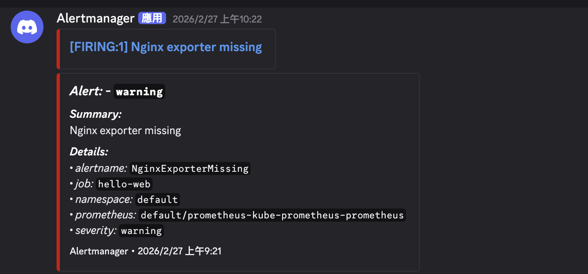

# Kubernetes 可觀測性平台

一套架設於 Kubernetes 上的監控系統，涵蓋指標收集、告警、視覺化與身份驗證，所有配置皆以程式碼管理（IaC）。

使用的技術：Kubernetes、Prometheus、grafana、Keycloak

---

## 架構概覽

架設於 Kubernetes，相依套件透過 Helm 安裝

```
nginx  -->  prometheus  -->  alertmanager  -->  Discord
  |               |
  |           grafana  <--  keycloak
  |               |
  +---------------+
      （指標流向）
```

nginx pod 透過 sidecar exporter 輸出 Prometheus 指標，Prometheus 定期抓取並在規則觸發時通知 Alertmanager。Alertmanager 經由 Discord adapter 將告警送到 Discord 頻道。Grafana 查詢 Prometheus 呈現儀表板，登入則委由 Keycloak 處理，實現 SSO。

---

## 資料夾結構

### `nginx/`
被監控的應用程式。一個最小化的 nginx pod，搭配 `nginx-prometheus-exporter` sidecar，將 nginx stub status 轉換為 Prometheus 格式的指標。此資料夾是整個資料流水線的起點。

### `prometheus/`
負責發現 nginx 並觸發告警的 Prometheus 配置，包含兩個 Kubernetes 自定義資源：
- `service-monitor.yaml` — 告知 Prometheus Operator 要抓取哪個 Service
- `prometheus-rule.yaml` — 定義告警條件（exporter 消失、連線數過高、請求量暴增）

這兩個檔案是串接 `nginx/` 與 `alertmanager/` 的橋樑。

### `alertmanager/`
處理告警觸發後的後續動作，包含：
- `alertmanager-config.yaml` — 路由規則，比對 nginx 告警並導向 Discord 接收端
- `discord-adapter.yaml` — 一個輕量的 adapter deployment，負責將 Alertmanager 的 JSON 格式轉換為 Discord webhook 所接受的格式

### `grafana/`
視覺化層，包含：
- `grafana-values.yaml` — kube-prometheus-stack Helm chart 的 values，包含指向 Keycloak 的 OIDC 配置
- `grafana-dashboard-configmap.yaml` — 預先建好的 nginx 指標儀表板，透過 ConfigMap label 由 Grafana 自動載入

Grafana 是唯一需要使用者登入的元件，因此依賴 Keycloak 提供身份驗證。

### `keycloak/`
Grafana SSO 的身份提供者。`docker-compose.yaml` 啟動一個以 PostgreSQL 為後端的 Keycloak 實例。`keycloak-import/` 子目錄包含一個自定義 Docker image，在容器首次啟動時自動匯入 realm 配置，讓 Grafana 的 OIDC client 無需手動設定即可就緒。

---

## 元件關係

| 來源 | 目標 | 連接方式 |
|------|------|----------|
| `nginx` | `prometheus` | ServiceMonitor 透過 label `app: hello-web` 選取 Service |
| `prometheus` | `alertmanager` | PrometheusRule 在 nginx 指標異常時觸發告警 |
| `alertmanager` | Discord | Discord adapter 轉換並轉發告警內容 |
| `prometheus` | `grafana` | Grafana 以 Prometheus 作為資料來源進行查詢 |
| `keycloak` | `grafana` | Grafana 透過 OIDC 將登入委派給 Keycloak |
| `grafana` | `nginx` | 儀表板視覺化 Prometheus 所收集的 nginx 指標 |

---

## 這套架構的亮點

這個專案從應用程式本身出發，把指標收集、多條件告警、格式轉換通知、視覺化儀表板、角色權限登入全部串成一條線，部署完即可使用，不需要進 UI 手動補設定。

其中兩個細節值得一提：Keycloak 容器啟動時自動匯入 realm 配置，Grafana 則透過 ConfigMap label 自動載入儀表板，兩者都不需要額外操作就能就緒。

### 告警實際觸發結果

